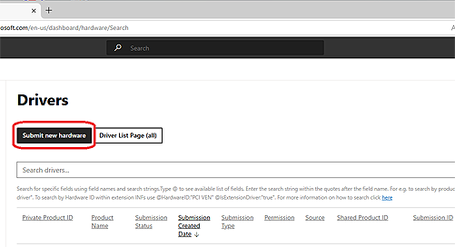
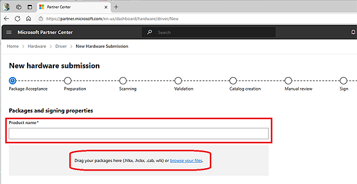
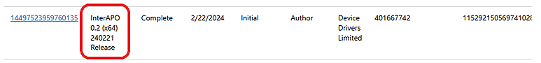
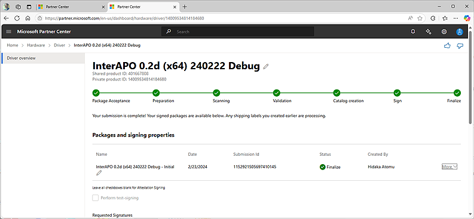
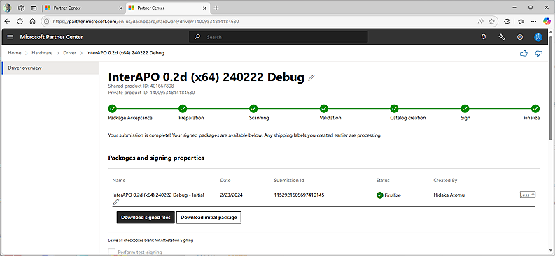

# 2024-0725.md

## 今どきの構成証明書署名（2024年版）

久しぶりにドライバー署名を取り上げる。
ドライバー署名は今のWindows ドライバー配布に必須で、次の2種類がある。

1. HLK テスト済みのダッシュボードで署名されたドライバー
2. テスト シナリオ用の Windows 構成証明署名付きドライバー 

参考記事）
https://learn.microsoft.com/ja-jp/windows-hardware/drivers/dashboard/code-signing-reqs

次の違いがある。
HLK テスト済み署名は申請の際、該当のHLKテストに合格して、Windows HLK Studio でテスト結果とシンボル（オプション）をまとめて申請する。
Windows Updateでの配布が可能である。

一方で構成証明署名付きドライバー は自身で申請するドライバーパッケージを、CABファイルにまとめて申請する。

前記資料に、テスト目的でのみ、HLK テスト不要で構成証明署名のためにドライバーを送信できます。」と明確に記されている様に、一般向け配布は想定しておらず、Windows Updateからの配布は出来ない。

申請手順はどちらも共通で、あらかじめMicorosoftパートナーに登録してハードウェア ダッシュボードに申請団体とユーザーを登録しておく必要がある。

Microsoft Windows ハードウェア開発者プログラムへの登録
https://learn.microsoft.com/ja-jp/windows-hardware/drivers/dashboard/hardware-program-register

登録にはEV証明書というUSBドングル型の証明書を、コード証明書発行事業者から購入しておく必要がある。

https://learn.microsoft.com/ja-jp/windows-hardware/drivers/dashboard/code-signing-reqs

にいくつかの事業者が載っているが事業者は毎年の様に変わり、また他の事業者発行のものでも可能だ。
弊社では取得価格が安価、継続利用割引きがあるという理由で、comodosslstore で調達している。

https://comodosslstore.com/

## EV証明書の申請と使い方

必要書類や手続きは、発行事業者や申請年度によっても多少変わるが、日本国内の代理店に登記簿謄本の写しを送る程度だったと記憶している。

## ダッシュボード

ダッシュボードの利用開始時には、利用団体の Microsoft Entra ID が必要である。 
手順は下記のとおりである。
https://learn.microsoft.com/ja-jp/windows-hardware/drivers/dashboard/hardware-program-register

アカウント開設時には、ダッシュボードからダウンロードした Winqual.exe ファイルに、EV証明書により署名して送る。
この作業はダッシュボードを利用する限りは毎年必要なため、実質的にはEV証明書も毎年購入する必要がある。

署名済　Winqual.exe ファイルを提出すると約1日程度でダッシュボードが利用可能になる。

## Windows Hardware Lab Kit

HLK テスト済み署名の申請は、Windows HLK Studio で可能で、Windows Hardware Lab Kit で解説されている。

https://learn.microsoft.com/ja-jp/windows-hardware/test/hlk/

## 構成証明書署名の申請手順

以下に構成証明書署署名取得のための、ダッシュボードへの申請手順を示す。

1. 申請するドライバーパッケージ（PDB付き）用意、デバッグビルドでも可能、シンボル
2. CABファイル作成
3. EV証明書で署名
4. 申請のサブミット
5. 署名済パッケージの受け取り

### 申請するドライバーパッケージ（PDB付き）用意、デバッグビルドでも可能、シンボル

以下に具体的な事例を紹介。

用意するディレクトリとファイルの構成

```sh
C:\EV\ -- ルートディレクトリ
C:\EV\Cab\ -- Cab ディレクトリ
C:\EV\Cab\submission-250106 -- Submission ディレクトリ
C:\EV\Cab\submission-250106\HowToMakeCab.txt -- 使い方のメモ
C:\EV\Cab\submission-250106\Submission.ddf -- 作成指示ファイル（毎回作成・確認）

C:\EV\Package\ -- Packageディレクトリ
C:\EV\Package\MapleHID -- 署名対象パッケージのディレクトリ

C:\EV\Package\MapleHID\MapleDrv.sys -- 署名対象ドライバー（*.SYS）
C:\EV\Package\MapleHID\MapleDrv.inf -- 署名対象INF（必須）
C:\EV\Package\MapleHID\MapleDrv.pdb -- 署名対象ドライバーのシンボル（無くても可）
```

### CABファイル作成

前期の構成の場合は、次内容のコマンドファイルにしておくと便利で、繰り返し利用も可能。

HowToMakeCab.txt の内容

```sh
MakeCab /f Submission.ddf
```

Submission.ddf の内容（使用の都度、確認と変更が必要）

```sh
;*** Submission.ddf
;
.OPTION EXPLICIT     ; Generate errors
.Set CabinetFileCountThreshold=0
.Set FolderFileCountThreshold=0
.Set FolderSizeThreshold=0
.Set MaxCabinetSize=0
.Set MaxDiskFileCount=0
.Set MaxDiskSize=0
.Set CompressionType=MSZIP
.Set Cabinet=on
.Set Compress=on
;Specify file name for new cab file
.Set CabinetNameTemplate=MapleHID.cab
; Specify the subdirectory for the files.  
; Your cab file should not have files at the root level,
; and each driver package must be in a separate subfolder.
.Set DestinationDir=Package
;Specify files to be included in cab file
```

### EV証明書で署名

一番の注意点。前述の、EV証明書の Signtoolの書法（パラメータ）だと、EV署名が出来ない場合が多い。
しかもそのパラメータや実行の指定ファイルが、ときどき変わる場合がある点に注意が必要がある。

今回のEV署名実行用コマンドファイルは以下の通り。
今回の申請からEV証明書申請の確認の連絡が日本語を話す代理店経由に変わった。
そのせいか、会社名がこれまでの英語表記から日本語表記に代わり、恐ろしく不便になった。
「株式会社デバイスドライバーズ」の部分の日本語文字列コードは、コマンドプロンプトを起動して手入する以外の方法では受付けられない。不便であるし、注意が必要である。

EV証明書署名用の CabSign.cmd の内容

```sh
signtool sign /sha1 dd9a4753f4d676beb9f4bbeedd37dc50e6613b91 /tr http://timestamp.sectigo.com /td sha256 /fd sha256 /n "株式会社デバイスドライバーズ" file
```

### 申請のサブミット（画面）

Submit new hardware をクリックしてEV証明書で署名した パッケージCABファイルを送信。

<a href="img/db-1p.png"></a>

送信の際は唯一の識別子「Product Name」を付ける必要があるので、事前に名前を用意しておくとよい。

<a href="img/db-2p.png"></a>

署名を貰った「Product Name」は永久にここのダッシュボード管理されるので、日付、バージョン、アーキテクチャといった情報を付加しておくべきである。

<a href="img/db-3p.png"></a>

### 署名済パッケージの受け取り

10分から長くても1時間程度で署名が完了する。

<a href="img/deccnter-2.png"></a>

署名が完了すると、わかり難いが進行状況表示バー右端下に < More > の表示。これをクリックすると「Download signed files」黒いボタンが現れる。この黒いボタンをクリックすることで念願の署名済パッケージを圧縮したzipファイルをダウンロードすることが出来る。

<a href="img/deccnter-3.png"></a>

## 注意点

- 署名対象ドライバーのアーキテクチャの変更

Windows 11 では当然ながら アーキテクチャ無印の32bit署名が無くなり、代わりに ARM64が追加されている。

- ダッシュボードページの可用性

ときどきダッシュボードのサイトが、止まっている場合がある（毎年、年に数回程度）

## 参考リンク

Windows 10用ドライバー署名（2019年版）
http://www.devdrv.co.jp/hidaka/node/69
