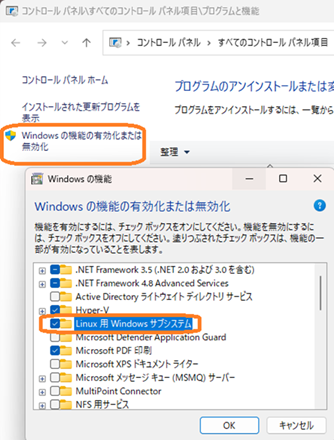
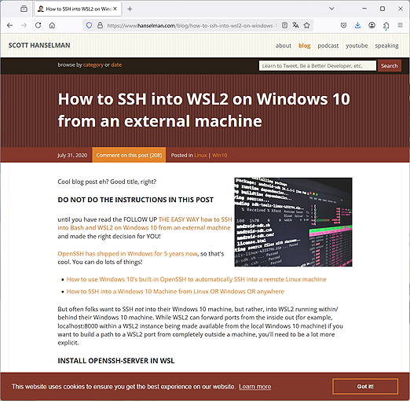
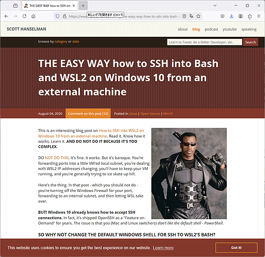

# 2024-0829.md

## WSL

5月頃にCQ出版社から、マイコンでYoctoで、デバイスドライバー開発のセミナーを開催出来ないかと打診があったので少し考えた。

セミナーで使うマイコンクロス開発環境ツールはWindows、一方でYoctoはLinux、ターゲットマイコンのターゲットを含めると三種類の環境セミナーでコンパクトに使いこなす必要がある。
仮想化は準備、持ち込みPCの性能に影響を受け易く敷居が高いので、WSL2の活用を検討した。
WSL2は最近触っていなかったので、現在の動作状況も確認した。

### WSL の簡単インストール

WSLはWSL1の頃から使用経験があるが、調べてみると現在は実質WSL2だけしか使われていない様子だ。
ということで、この記事も以降はWSL=WSL2 と仮定し、WSLと省略して記す。
セミナーの実習環境として使用する場合の一般的なインストール手順を示す。

### インストール手順

Ubuntu 20.04を例にインストール手順を示す。
注意点はまず実行PCのBIOSで、システムの仮想化を有効にしておく。Intel: VMX または VTx, VTT, VT-d など、AMD: SVM Mode または AMD-V などである。
次にコントロールパネルのWindowsの機能を開いて、Linux 用 Windows サブシステム を有効化しする。
この機能の有効化はあまり知られていないが、実体は C:\WINDOWS\System32\bash.exe のインストールである。
この Windowsネイティブで動作するBashこそがWSL (1) の原点であり、また今回説明する THE EASY WAY 版OpenSSH の実体でもある。

**すなわちTHE EASY WAY 版OpenSSH を使用しない場合はこの、Linux 用 Windows サブシステム を有効化しなくても WSLは動作し、リモートからのSSHアクセスが可能となる。**

### WSL へのログイン DO NOT DO 版

- openssh インストール確認
- sshd_config 設定修正
- ssh ポートリダイレクト設定（Windows）
- ファイアーウォール設定（Windows）
- Linux sshd サービス登録

前述の通り、Linux 用 Windows サブシステム の有効化不要で動作するが、localhost と 127.*.*.* は使えない。

### WSL へのログイン The EASY WAY 版

- OpenSSH 設定確認
- shd 起動・設定
- bash.exe shell 設定

localhost と 127.*.*.* も使える

Windows パスワードは必須

その後公開されていたScottのブログで、もっと簡単な方法があるから以前教えた方法は使うなと言っていたので、それを検証したので整理

## 参考のリンク

Tips and tricks for WSL users. part-1

https://www.youtube.com/watch?v=S78OAxQjPoA

PPT 2024/8/27: Tips and tricks for WSL users: Two easy and reliable ways to get started with OpenSSL Server

https://www.slideshare.net/slideshow/tips-and-tricks-for-wsl-users-two-easy-and-reliable-ways-to-get-started-with-openssl-server/271345097

