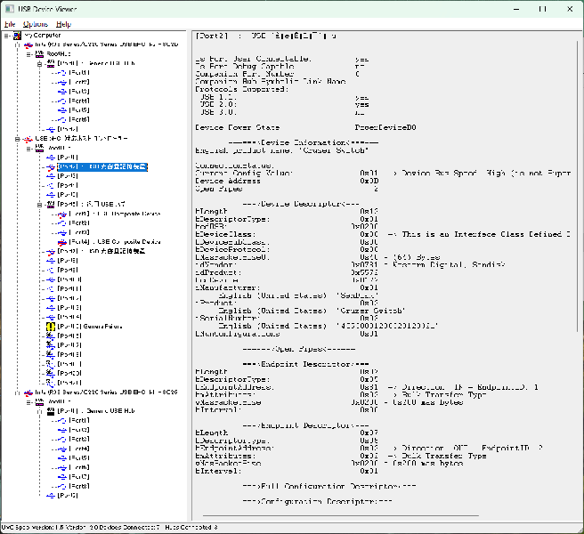

# 2024-0910.md

## MSコミュニティー15周年

[Microsoft コミュニティーが 15 周年を迎えました！](https://answers.microsoft.com/ja-jp/feedback/forum/all/microsoft/9d3a348d-3834-4252-b65d-6adc1bce92f2)

https://answers.microsoft.com/ja-jp/feedback/forum/all/microsoft/9d3a348d-3834-4252-b65d-6adc1bce92f2

Celebrating 15 years of the Microsoft Community | Microsoft

https://answers.microsoft.com/ja-jp/feedback/forum/all/microsoft/9d3a348d-3834-4252-b65d-6adc1bce92f2

https://www.youtube.com/watch?v=bsslbp1-JKg

LinkedIn: 
https://www.linkedin.com/company/microsoft-support-community/posts/

Microsoft コミュニティが 15 周年を迎えた。

モデレータとしての参加時期は 2008年、Microsoft コミュニティ（当初はANSWERS と称した）運用開始当初から、呼びかけに応じるまま登録し、そのまま自動的に個人レッスンを受けて登録されたことはよく覚えている。

何しろコミュニティーへの投稿経験がまだ無いコミュニティーで、いきなりモデレータとして何をすればいいのかが良く理解出来ていなかったので、ひたすら回答者の役割に徹していた。その頃の状況は以下でも語っている。

5 in 10 Podcast Episode 2 
https://www.youtube.com/watch?v=3VS0hf3iTzo

正直言ってまともにモデレータ活動をしたのは、Windows 8, 8.1の無償更新問題が落ち着いて、報酬目的の独立アドバイザー が一層された2020年以降のことである。それはともかく最近は、自分自身の活動メモとして、各種記事を書いている。

## 以外な人気！USBView

以外な人気に気付いたのは、去年英語版向けに書いた、USBView の下記の記事がいつの間にか4, 000件以上のアクセスを得ていたことである。

英語版記事：

How to use and Install USBView
https://answers.microsoft.com/en-us/windows/forum/all/how-to-use-and-install-usbview/e66494f9-05ce-439e-bcbe-c074b36d4272

ということで日本版はまだ不人気？の、USBView のインストールと使い方の日本語版記事を紹介する。

日本語版記事：

[USBView のインストールと使い方](https://answers.microsoft.com/ja-jp/windows/forum/all/usbview/4bb21726-b0ab-49c8-91d0-bbe700320bf6)

## Windows SDK のダウンロード

USBView をインストールするためには、<a href="https://developer.microsoft.com/ja-jp/windows/downloads/windows-sdk/" target="_blank">Windows SDK インストーラー winsdksetup.exe をダウンロードして起動します。

インストール時にはオプション設定が必要なため、前述の記事にしたがって選択する必要がある。

## 参考：USBView

<a href="https://learn.microsoft.com/ja-jp/windows-hardware/drivers/debugger/usbview?WT.mc_id=WDIT-MVP-35878" target="_blank">USBView</a>
