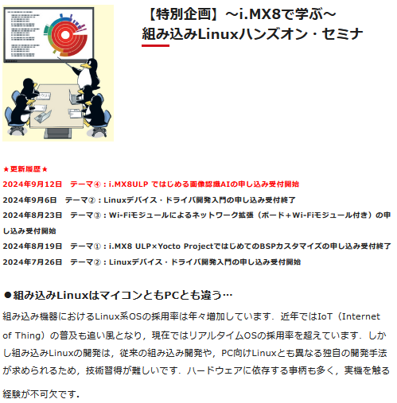

# 2024-0922.md

## セミナー準備とYocto Linux

CQ出版 編集部からの依頼で、9月27日のマイコン活用のハンズオンセミナーの開催が決まったので、WSL2 (以降 WSL) を中心に事前調査・実験を繰り返して実現方針を固めた点をまとめる。

ハンズオンセミナーは抽選で選抜された10名の参加者にたいして、i.MX8ULP マイコンを配布して、組み込みLinuxの基本を伝授するという内容。
事前に提出した紹介文の口上は次の通りである。

本セミナでは，以前のインターフェース掲載記事を元した単純な入門用ドライバと，オリジナルの汎用IoTドライバを教材に，組み込みLinuxにおけるドライバ開発の基本，最近のAI利用のコーディングから，デバッグ手法とパッケージングまでを習得することを目指します．開発環境はPC 1台で開発の全てをホストする，WindowsとWSLを使用します．合わせて，その上でYocto Projectを稼働させて開発するためのノウハウも伝授します

この口上の通り開発環境はYoctoで、組み込みLinuxの基本からAIコーディングとデバッグを含んで、ハンズオンは朝10時からはじめて午後5時終了と、なかなかのハードスケジュールである。

以前の記事の通り、Windowsホストでの組み込み開発ツール、Yocto のクロス開発ハンズオンをコンパクトに実現させるため、WSLの採用を検討していた。

今回セミナーで扱うAVNET社提供の、i.MX8ULP用のツールチェインを含むYocro環境を何回か動作確認したところ、ネイティブの Ubuntu 20.04 での使用容量が 290GBで、SDK含めたシステム構築に 2～6時間かかることが判明している。事前に環境構築して貰うにしても、初心者向けには敷居が高く、ハンズオン当日では使い物にならない。

これをWSLで実装実験して、たまたま動作しないSDKの一部を事前ビルドさせないことで、ビルド済の仮想ディスク容量が 96.9GB、さらにそれを zip 圧縮すると 37.1GB になることを確認した。
WSLは作成・動作確認済みの仮想環境を圧縮して、IMPORT / EXPORT 出来ることが心強い味方である。

ドライバー開発のハンズオンでは、昔まだ Linux カーネルが 2.4だった頃に実験してインターフェース誌の記事として公開した、Linuxカーネルドライバーで直接 TCP/IP 通信をするローダブルモジュールドライバーを取り上げることにした。

以前の記事ではLinuxカーネルがアプリケーションを介さずに直接通信するので、データ計測時の無用なトラフィックが無くなり、ネットワーク経由でのデータ計測が正確になるというテーマだった。
今回のハンズオンセミナー取り上げるのは、ドライバーだけのビルドで通信実験が出来るため、アプリケーションの用意が不要になり、演習時間が短縮出来るからだ。
課題としては、Windows で遮断された WSL のサービスでは直接コネクションを受信出来ない点であるが、発信は出来て、WSLとi.MX8ULP マイコンとで通信実験が出来るのだから、それで十分だと考えた。

## ChatGPTから提案

AIによるコーディングも予定通り上手くいったので、おまけとしてデータ通信完了時にLEDで知らせるオプションドライバーの実装もコーディングさせてみた。

i.MX8ULP マイコンのLED制御処理はスタティックにカーネルに組み込まれているため、独立したドライバーとしての切り出しは困難かと思われたが、ChatGPTから SysFS経由での制御を提案され、これを試したところ上手く行くことを確認した。さらにはPC Linux での同様のLED制御ドライバーが動作することまで確認出来たので、生成AIの洞察力に関心した。
おそらくは様々な事例を知識として持っているので、それをプロンプトで引き出すことが出来れば、アイデア出しの有能なツールとして使えるということである。

## ソースコード

Hello Linux Driver （Kernel 6.5 用） - 入門用各種ドライバー
https://github.com/ahidaka/HelloLinuxDriver

GeneralIoTModules - カーネルモジュールUDP通信ドライバー
https://github.com/ahidaka/GeneralIoTModules

SysfsLedController - LED点灯制御ドライバー
https://github.com/ahidaka/SysfsLedController

GreetingLinuxDriver - Yocto 組み込み演習用ドライバー
https://github.com/ahidaka/GreetingLinuxDriver

## 資料

Linuxデバイス・ドライバ開発入門 ハンズオン環境インストール方法の解説
InstallingWSLEmbeddedLinux
公開先： https://ahidaka.github.io/InstallingWSLEmbeddedLinux/
ソースコード：https://github.com/ahidaka/InstallingWSLEmbeddedLinux

～i.MX8で学ぶ～ 組み込みLinuxハンズオン・セミナ 参加者向けリンク集
EmbeddedLinuxDevelopmentLinks
公開先： https://ahidaka.github.io/EmbeddedLinuxDevelopmentLinks/
ソースコード： https://github.com/ahidaka/EmbeddedLinuxDevelopmentLinks

～i.MX8で学ぶ～ 組み込みLinuxハンズオン・セミナ 参加者向けリンク集
EmbeddedLinuxDevelopmentLinks
https://github.com/ahidaka/EmbeddedLinuxDevelopmentLinks
公開先： https://ahidaka.github.io/EmbeddedLinuxDevelopmentLinks/
ソースコード： https://github.com/ahidaka/EmbeddedLinuxDevelopmentLinks

 受講者用のセミナ環境を準備するための環境構築に必要な手順の説明
BuildingWSLEmbeddedLinux
ソースコード： https://github.com/ahidaka/BuildingWSLEmbeddedLinux
