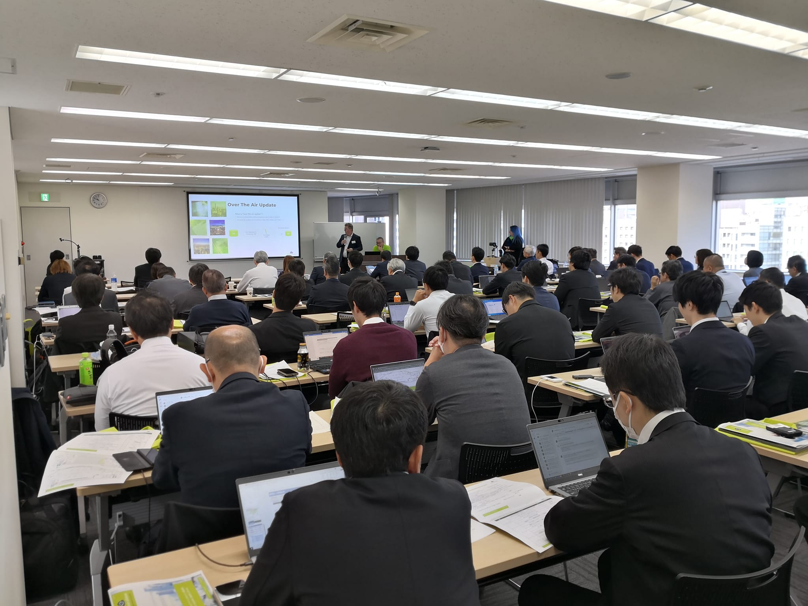

# 2924-1117.md

## EnOcean Alliance Japanese Event

11月8日に恒例の EnOcean Alliance 日本イベントが市ヶ谷で開催され、120名以上の参加者が集まった。

EnOcean Alliance での新しい情報としては、新製品のセンサーモジュールと通信モジュールが中心で、日本国内の市場も一段落した感があった。
参加各社からの個別事例の発表においては、生成AI関連に触れたのは弊社だけで、相変わらず生成AIのIoT応用の難しさと、日本国内のAI導入の遅れを確認した様に感じた。

毎年この秋の開催に合わせて、日本企業の活動内容や製品を載せた、EnOcean Alliance Journal が作成されて配布されている。

## EnOcean Alliance Journal 解説 とURL

https://www.enocean-alliance.org/wp-content/uploads/EnOcean_Alliance_Journal_2024_web.pdf

https://www.enocean-alliance.org/ja/marketing-material/events/

https://www.facebook.com/groups/1513184628905668

## Azure Open AI Studio

弊社からの発表は去年から継続しての、マルチセンサーで取得そたIoTデータをいかにして、生成AIに解析させるかである。
GAで使える様になった、Azure Open AI Studio を使用して、**Azure OpenAI on your data** 機能で自前データを RAG によるChatGPT-4o のカスタマイズに利用する。

IoTの様なデータ解析において生成AIにハルシネーション（嘘）を言わせない方向に導くためには、この様な実データによる誘導が重要な役割を果たす。

Azure Open AI Studio では .txt .md .html .docx .pptx .pdf といった一般的なデータをこの「Azure OpenAI on your data」の入力として利用出来る。
まさに IoT分野での利用に適していると考える。

サポートされるデータソースは次の通りで、IoT用途でも使い易い。
    - Azure AI Search
    - ファイルのアップロード (Preview)
    - URL/Web アドレス (Preview)
    - Azure Blob Storage (Preview)
    - Azure Cosmos DB
    - Elasticsearch ベクトル データベース(Preview)

利用可能なリージョンにも大きく依存するが、Azure Open AI が現在提供中のモデルは次の通り。

- GPT-4o, GPT-4 and GPT-4 Turbo Preview
- GPT-3.5
- Embeddings （埋め込み）
- DALL-E（画像生成）
- Whisper（発話）
- Text to speech (テキスト読み上げ、Preview)

ということで、すでに一通りの機能が利用可能である。
Azure Open AI Studio の **Azure OpenAI on your data** 機能のよる解析の一つ前のバージョンは前述の、EnOcean Alliance Journal でも解説している。

## SlideShare 資料

https://www.slideshare.net/slideshow/customize-chat-gpt-using-azure-openai-studio/270742327

## YouTube 解説動画

Azure OpenAI Studio で Chat-GPTをカスタマイズ
https://www.youtube.com/watch?v=IPgzKO3yWn0
