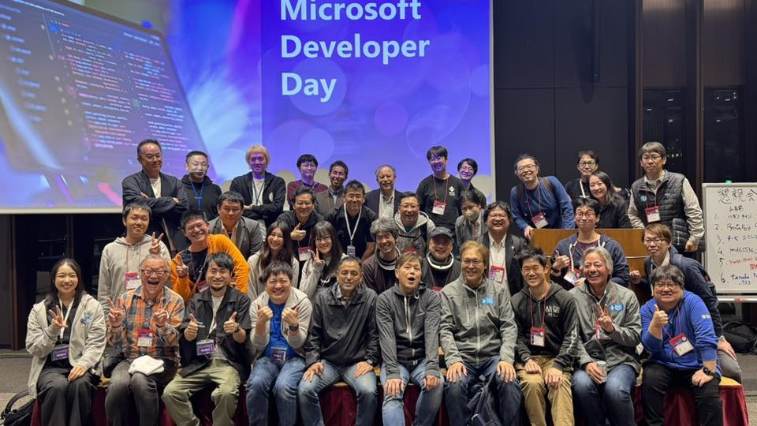

＃ 2024-1129.md

## Microsoft Developer Day

先日、千代田区大手町、大手町プレイス (イーストタワー) で開催された「Microsoft Developer Day 〜 AIで開発者の力を最大限に引き出す」に、スタッフとして参加した。
日本マイクロソフトではこの様に不定期で、ときおり「今が旬」のトピックをテーマにしたイベントを開催するが、今回はまさに生成AIがテーマで、特に今注目を浴びつつあるマルチモーダルなエージェントがハイライトされていた様子である。

イベント開催ページの紹介によると、基調講演に加え、「AI Development（AI開発）」と「Developer Productivity（開発者の生産性）」の2つのトラックで合計12を超えるセッションが行われ、展示ブースやアンカンファレンス形式のネットワーキングパーティもあり、参加者は最新技術の情報を得るとともに、業界の専門家との交流を深めることができるとある。

実際に参加して、セッションはAzure AI活用、.NET、GitHub から、技術コミュニティ参加のすすめ、まで幅広いテーマで、生成AIにアプローチしていた。
個人的には、AIの倫理的に活用するための知識と、一般社団法人CTO協会の案内に興味を引いた。
勿論知り合いの参加者も多く、パーティーやLTもあり、盛りだくさんのお祭りという感じであった。

[Microsoft Developer Day](https://msevents.microsoft.com/event?id=1289012583)

https://msevents.microsoft.com/event?id=1289012583

## コミュニティー紹介

我々は専用テーブルで、夜のネットワーキングパーティの時間に参加者向けに、積乱雲プロジェクト技術部の活動紹介を行った。
積乱雲プロジェクト技術部は、MVPの本田寿明氏と、不定期に行っている活動である。

積乱雲プロジェクトは、2013年12月関西で発足し2016年6月には関東にも波及。卓越した技術を持つ中小企業が連携することで、センサと機器の接続から安全対策、クラウド整備まで一貫したソリューション開発を可能た活動を行っている企業団体である。センサからクラウドまで顧客の要望に応じて柔軟に対応できる体制を整え、幅広いIIoT市場に向けマーケティング活動を通じ、ビジネスモデルおよび技術を模索し、新たな付加価値創造に向けチャレンジを続けてい。

[積乱雲プロジェクト ホームページ](https://bell-c.co.jp/thundercloud/)

[積乱雲プロジェクト 参加企業](https://bell-c.co.jp/thundercloud-member/)

現在はIIoT LAB として各社が持ち寄ったIOT機器の接続検証や各種顧客向けデモを公開していて、弊社でも EnOcean センサーをデモ提供している。
