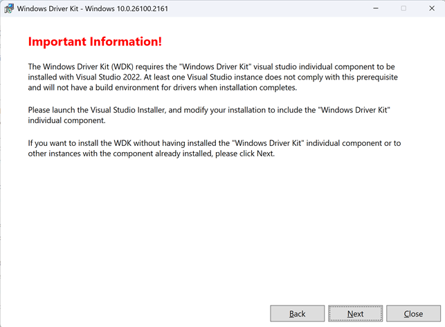

# 2023-1205.md

## 今どきのWindows ドライバー開発

久しぶりのドライバー開発の話題だ。
SDKのバージョン、入手方法、違い。
WDKのバージョン

## 最新WDKと24H2

環境設定時の使い勝手が、これまでと異なるのは、テンプレートをインストールするHelperが、Visual Studioのインストール・オプションに組み込まれた点だ。

SDK新機能

WDK新機能

WDK VSIX がインストールされていないコンピューターに WDK MSI をインストールしようとすると、インストールの開始時に次の警告メッセージが表示されます。

## BCDEdit 裏技紹介

## 究極の裏技

bcdedit /copy {current} /d "Windows 11 Debug"
ebug エントリーをコピー作成語、セキュアブート無効化（再起動）

msconfig を起動して Debug エントリーをデフォルト設定して、再起動

bcdedit /set {current} testsigning on
設定して再起動

UMDF2
ユーザーモードドライバーの動作確認

カーネルモード

ドライバー署名の強制を無効にする

をよく使う

その手順のリンク

それよりも簡単で、より開発向けの手順を紹介する。

ポイントは、
BCEのエントリーで、オプションで起動すると、「ドライバー署名の強制が無効になる」
この一点だけである。それだけでは使いにくいので、合わせて予備のBCDエントリーを作成する手順とともに紹介する。

### 手順

１．現在のBCDエントリーを複製して、新しくデバッグ用のエントリーを作成
★名前の付け方

２．BCDのタイムアウト時間、オプション、デフォルトエントリーを設定

３. 再起動して動作確認

## 関連情報

32bitのドライバーは開発して、実験できるか？
W10が無くなった後の状況だが、特別な用途でもない限り32bit版は不要かも知れない。

リンク

SDK
WDK

 24H2の新機能を整理して紹介は別にする！

https://learn.microsoft.com/en-us/windows-hardware/drivers/wdk-release-notes

https://learn.microsoft.com/ja-jp/windows-hardware/drivers/wdk-release-notes

