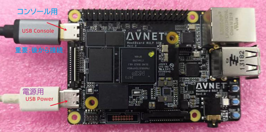
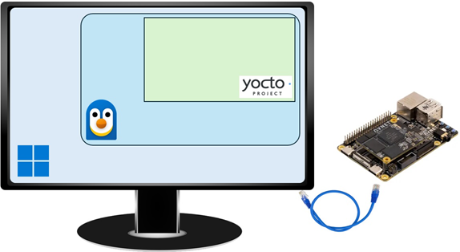

# 2024-1215.md

本セミナでは，以前のインターフェース掲載記事を元した単純な入門用ドライバと，オリジナルの汎用IoTドライバを教材に，組み込みLinuxにおけるドライバ開発の基本，最近のAI利用のコーディングから，デバッグ手法とパッケージングまでを習得することを目指します．開発環境はPC 1台で開発の全てをホストする，WindowsとWSLを使用します．合わせて，その上でYocto Projectを稼働させて開発するためのノウハウも伝授します

[【特別企画】～i.MX8で学ぶ～組み込みLinuxハンズオン・セミナ](https://interface.cqpub.co.jp/linux-hands-on/)
https://interface.cqpub.co.jp/linux-hands-on/

1回目 09/27
2回目 12/09

## CQセミナー開催

## 関連情報

セミナーのリンク

写真が問題＝ボード、デモ画面

maax-connect6-50.png

Hands-on-Env1-50.png

過去2回分のセミナーのトピックス

実施した内容（全体の流れ、手順）

AIは有効、誰でもできる
i.MX8ULPの場合は、Yoctoは

セミナー開催要綱

## セミナー関連URL と注意点

事前準備環境と準備手順

提示された資料と問題点

問題点への対応

### 当日配布URL

## 資料

Linuxデバイス・ドライバ開発入門 ハンズオン環境インストール方法の解説
InstallingWSLEmbeddedLinux
公開先： https://ahidaka.github.io/InstallingWSLEmbeddedLinux/
ソースコード：https://github.com/ahidaka/InstallingWSLEmbeddedLinux

～i.MX8で学ぶ～ 組み込みLinuxハンズオン・セミナ 参加者向けリンク集
EmbeddedLinuxDevelopmentLinks
公開先： https://ahidaka.github.io/EmbeddedLinuxDevelopmentLinks/
ソースコード： https://github.com/ahidaka/EmbeddedLinuxDevelopmentLinks

～i.MX8で学ぶ～ 組み込みLinuxハンズオン・セミナ 参加者向けリンク集
EmbeddedLinuxDevelopmentLinks
https://github.com/ahidaka/EmbeddedLinuxDevelopmentLinks
公開先： https://ahidaka.github.io/EmbeddedLinuxDevelopmentLinks/
ソースコード： https://github.com/ahidaka/EmbeddedLinuxDevelopmentLinks

 受講者用のセミナ環境を準備するための環境構築に必要な手順の説明
BuildingWSLEmbeddedLinux
ソースコード： https://github.com/ahidaka/BuildingWSLEmbeddedLinux

